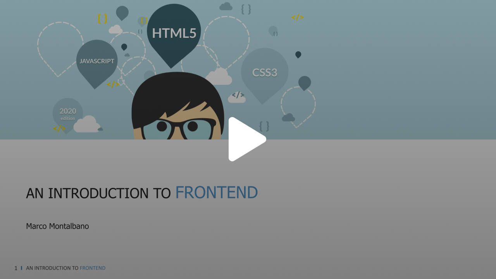

# An introduction to Frontend

Welcome to **An introduction to Frontend**, a learning resource designed to get you started with the fundamentals of frontend development.

In 2017, I developed and delivered a course tailored as an introductory program on frontend development specifically designed for backend developers and interns at Sopra Steria.

The course slides are available for reference here:

[](https://speakerdeck.com/marcomontalbano/an-introduction-to-frontend-2020-edition)

## What will you learn?

The course covers various topics to equip you with a solid foundation in frontend development, including:

* Building basic web pages with [**HTML**](https://developer.mozilla.org/en-US/docs/Web/HTML) and applying styles with [**CSS**](https://developer.mozilla.org/en-US/docs/Web/CSS).
* Learning the fundamentals of [**JavaScript**](https://developer.mozilla.org/en-US/docs/Web/JavaScript) and **DOM manipulation** to make your webpages interactive. 
* Understanding the benefits of using tools like:
  * **[NPM](https://www.npmjs.com/) (Node Package Manager)**:  A tool for managing code dependencies in your projects. 
  * [**Parcel**](https://parceljs.org/): It combines a great out-of-the-box development experience with a scalable architecture that can take your project from just getting started to massive production application.
  * [**Sass**](https://sass-lang.com/): A CSS preprocessor that extend the capabilities of CSS for writing cleaner and more maintainable styles.


## Getting started

To get started, you'll need a text editor or IDE (Integrated Development Environment) for writing code. Popular options include Visual Studio Code, Sublime Text, or Atom. Once you have a code editor, follow these steps:

```sh
git clone https://github.com/marcomontalbano/an-introduction-to-frontend.git

npm install

npm start
# http://localhost:1234
```

> You can find the final result here: https://marcomontalbano.com/an-introduction-to-frontend