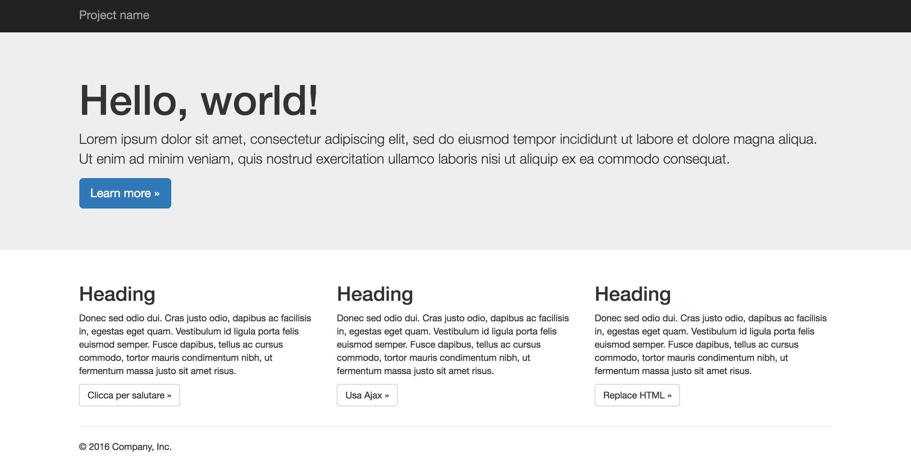

An introduction to Frontend for beginners
=========================================

Users
-----

Tutti quelli che hanno partecipato al corso troveranno una cartella con il proprio nome dentro `users`.

Questa è la vostra cartella di lavoro; qui dentro potrete committare tutti i file che vorrete, necessari a realizzare il layout mostrato nelle slide e spiegato nelle sessioni `Live Action`.

Dentro la vostra cartella si trova il file `index.html` necessario per partire con l'esercitazione.

Live Action
-----------

All'interno della folder `live-action` si trova il file `1-live-action.png`.

Il layout contenuto nel file sarà l'obiettivo che ci fisseremo per questa esercitazione.

Attraverso le sessioni in aula andremo a scrivere l'html, i css e i javascripts necessari per realizzare il layout, applicando di volta in volta tutte le nozioni apprese.

#### Modulo 1

Con il `modulo 1` sarai in grado di realizzarne la struttura HTML e i CSS neccessari per rappresentare graficamente il layout.

#### Modulo 2

Con il `modulo 2` dovrai andare a scrivere del codice javascript, utilizzando jQuery, che permetterà di aggiungere un po' di dinamismo alla pagina. I 3 pulsanti dei contenuti centrali dovranno rispettivamente:

1. mostrare un messaggio `Hello World!`.
1. fare una chiamata `ajax` ad un file html, la cui risposta mostrerà un messaggio `Hello World by Ajax!!`
1. rimpiazzare il testo del paragrafo appena sopra con un nuovo testo.

Successivamente dovrai modificare l'HTML e il CSS per ridisegnare il layout, utilizzando questa volta `Twitter Bootstrap`.

#### Modulo 3

Con il `modulo 3` dovrai andare ad aggiungere un po' di automazione.

Modificando l'HTML, dovrai sostituire l'utilizzo dei `CSS` con l'utilizzo dei `LESS`.
Aggiungerai `Bower` per poter installare Twitter Bootstrap come dipendenza e configurerai `Grunt` per automatizzare il processo di compilazione degli assets.

---

**Buon lavoro!**
